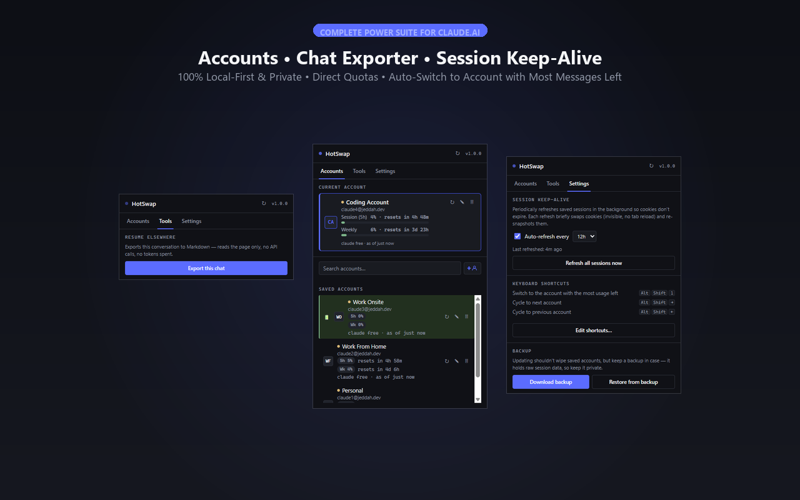
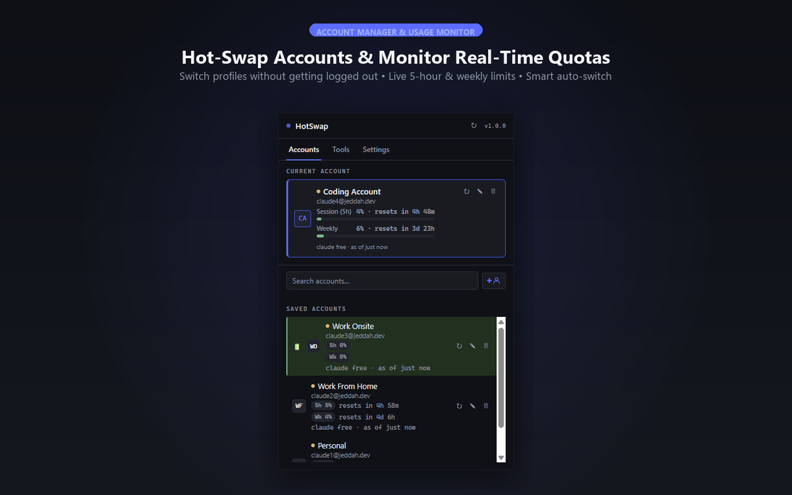
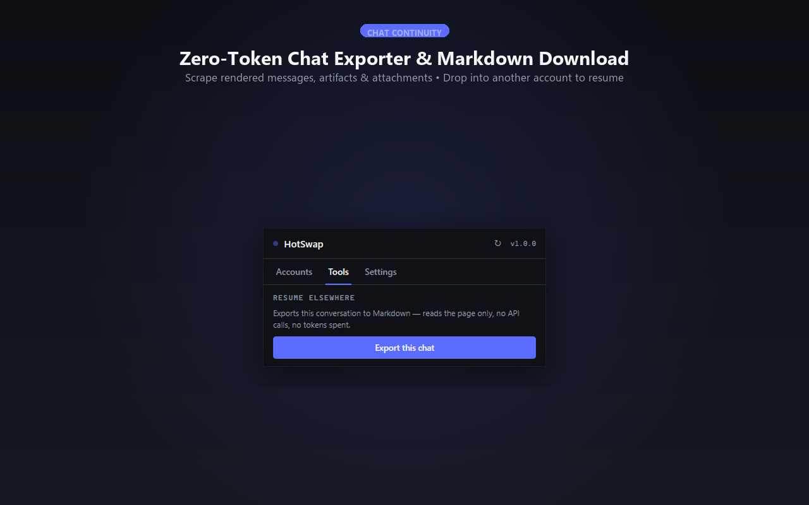
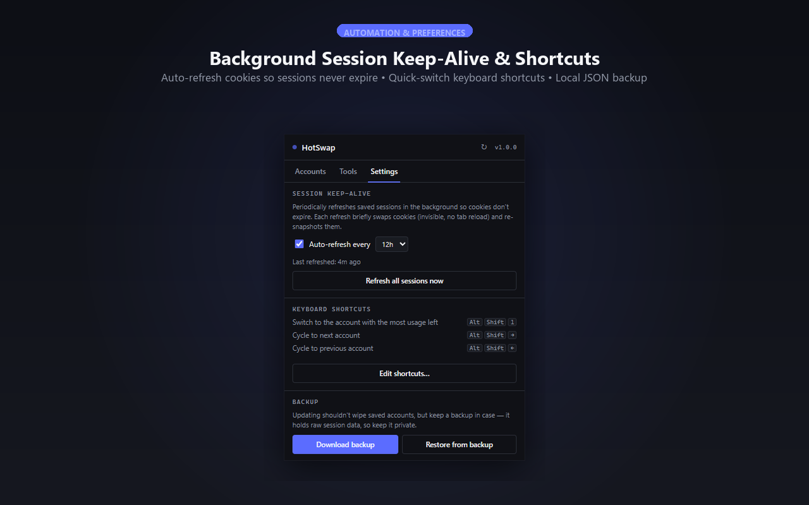

# HotSwap for Claude

<p align="center">
  
</p>

<p align="center">
  <a href="https://chromewebstore.google.com/detail/hotswap-for-claude/nnpnmjhealgmnbinplmccegkecabcpdk"></a>
  <a href="https://addons.mozilla.org/en-US/firefox/addon/hotswap-for-claude/"></a>
  <a href="./LICENSE"></a>
</p>

<p align="center">
  <strong>Fast, privacy-first browser extension for seamlessly hot-swapping between multiple Claude.ai accounts, monitoring real-time usage limits, keeping background sessions active, and exporting & summarizing conversations.</strong>
</p>

<p align="center">
  🌐 <a href="https://hotswap.jeddah.dev">hotswap.jeddah.dev</a> • 💬 <a href="mailto:support@jeddah.dev">support@jeddah.dev</a>
</p>

---

## 📸 Showcase

<p align="center">
  
</p>

| Accounts & Quota Tracker | Two-Tier Exporter & Summarizer | Session Keep-Alive & Themes |
| :---: | :---: | :---: |
|  |  |  |

---

## 🔥 Key Features

* **⚡ Instant Hot-Swapping**: Switch between saved Claude accounts in a single click or keystroke (`Alt+Shift+1` or `Alt+Shift+Arrows`).
* **🎨 Unified Theme Engine (3 Curated Palettes)**: Switch seamlessly between **Midnight** (signature high-contrast dark), **Claude Light** (native Claude ivory/clay), and **Claude Dark** (warm espresso).
* **🤖 Universal Gemini AI Context Handoff Summarizer**: Direct integration with Google's `gemini-3.5-flash-lite` generating high-density handoff markdown briefs (core objectives, tools, explicit user exclusions & preferences, decisions, deliverables, next steps) copied straight to clipboard with **zero file download overhead**.
* **📦 Lossless Raw Chat & Thought Exporter**: Traverses virtualized chat DOM without truncation, auto-captures Claude 3.7 / extended reasoning streams, deduplicates attachments, and bundles everything into a clean `.zip` archive.
* **🔒 Safe Local Session Swapping**: Swaps local browser cookies without triggering server-side logouts—all your accounts stay logged in simultaneously.
* **📊 Direct Quota & Reset Timers**: Real-time visibility into your 5-hour session limits and 7-day weekly caps across Free and Paid plans.
* **🔄 Session Keep-Alive**: Automatically exercises saved background sessions at custom intervals (default: 12h) to prevent cookie expiration.
* **🛡️ 100% Local-First & Private**: All session tokens and API keys are stored strictly in `chrome.storage.local`. Zero analytics, zero third-party telemetry.

---

## 🛠️ Build & Install from Source

### 1. Automated Packaging
Run the built-in packaging script (requires Python 3, zero dependencies):
```bash
python package.py
```
This builds ready-to-use ZIP archives in `dist/`:
* `dist/hotswap-for-claude-chrome-v1.1.0.zip` (Chrome, Edge, Brave, Opera)
* `dist/hotswap-for-claude-firefox-v1.1.0.zip` (Firefox)

### 2. Load Unpacked in Chrome / Chromium
1. Open `chrome://extensions/` and enable **Developer mode** (top right toggle).
2. Click **Load unpacked** and select the `extension/` folder.

### 3. Load Temporary in Firefox
1. Open `about:debugging#/runtime/this-firefox`.
2. Click **Load Temporary Add-on…** and select `extension/manifest.json`.

---

## 📜 License

This project is licensed under the **GNU Affero General Public License v3.0 (AGPL-3.0-only)**. See [LICENSE](./LICENSE) for details.
